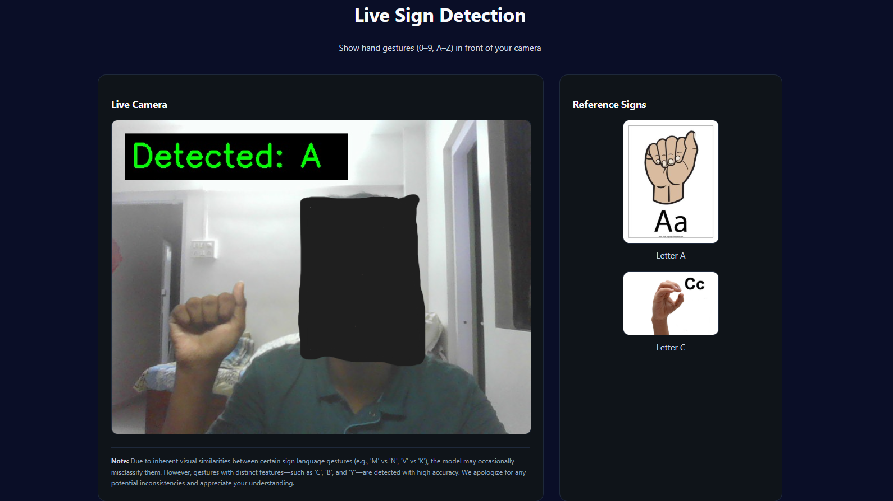
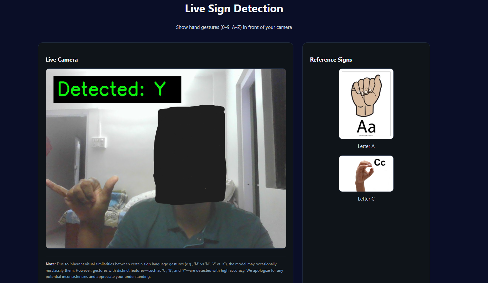

# SignVision AI - Real-Time Sign Language Detection (A-Z)

SignVision AI is an advanced machine learning application designed to detect and classify alphabet sign language gestures (**A-Z**) in real-time. By leveraging **MediaPipe** for precise hand landmark extraction and a robust **Random Forest Classifier**, it delivers high-accuracy predictions via a user-friendly Flask internet interface.

This project is optimized for real-time performance, offering both a local webcam interface and a cloud-ready API.

---

## 📸 Real-Time Detection Demo

The system effectively identifies sign language alphabets in real-time environments. Below are examples of the model correctly detecting unique signs:

### Detection of Sign 'A'


### Detection of Sign 'B'


---

## 📂 Key Project Files

To understand the core architecture of SignVision AI, here is a detailed breakdown of the critical scripts:

### 1. `collect_imgs.py`
**Purpose**: Automated Data Collection  
This script is the foundation of our dataset creation. It interfaces with the webcam to capture a structured dataset of hand gestures.
-   **Functionality**: Automatically iterates through the alphabet (A-Z).
-   **Mechanism**: Captures 400 images per class/letter.
-   **Usage**: It displays user prompts to position the hand correctly before initiating a rapid-fire capture sequence, ensuring consistent and diverse data for training.

### 2. `train_model.py`
**Purpose**: Model Training & Optimization  
This script handles the machine learning pipeline, transforming raw images into a deployable model.
-   **Process**:
    1.  **Landmark Extraction**: Uses MediaPipe to extract 21 3D hand landmarks (x, y, z coordinates) from each image.
    2.  **Vectorization**: Converts landmarks into flatten feature vectors.
    3.  **Training**: Fits a **Random Forest Classifier** on the processed data.
-   **Output**: Generates the `signs_AZ_rf_model.pkl`, a highly efficient serialized model ready for inference.

### 3. `app.py`
**Purpose**: Production Inference Server  
The main entry point for the application, serving as a Flask web server.
-   **Core Features**:
    -   **Web Interface**: Renders the HTML frontend for live interaction.
    -   **Inference Engine**: Loads the trained model and processes incoming video frames or base64 images.
    -   **Thread Safety**: Implements critical locking mechanisms (`threading.Lock`) to ensure MediaPipe runs safely in multi-threaded web server environments (like Gunicorn).
    -   **Auto-Recovery**: Includes logic to automatically download necessary model artifacts from Google Drive if they are missing.

---

## 🚀 Features

-   **Specialized A-Z Detection**: Fine-tuned specifically for the American Sign Language (ASL) alphabets.
-   **MediaPipe Integration**: incredible accuracy in hand tracking even in varying lighting conditions.
-   **Dual Mode Operation**:
    -   **Local Mode**: Direct webcam access for zero-latency testing.
    -   **Cloud Mode**: API-based processing designed for containerized deployments.
-   **Docker Support**: Fully containerized for consistent deployment across any platform.

---

## 🛠️ Tech Stack

-   **Language**: Python 3.11
-   **Web Framework**: Flask
-   **Computer Vision**: OpenCV, MediaPipe
-   **Machine Learning**: Scikit-Learn (Random Forest)
-   **Deployment**: Docker, Gunicorn

---

## 🐳 Docker Usage (Quick Start)

To quickly get the application up and running using Docker:

### 1. Pull the Image
```bash
docker pull vedteredesai/sld:v2
```

### 2. Run the Container
Run the container mapping port 5000.
```bash
docker run -d --name signvision-app -p 5000:5000 -e MODE=cloud vedteredesai/sld:v2
```

### 3. Access
-   **Web Interface**: `http://localhost:5000/`
-   **Health Check**: `http://localhost:5000/health`

---

## 📦 Local Installation

### Prerequisites
-   Python 3.10+
-   Git

### Steps
1.  **Clone the Repository**
    ```bash
    git clone <repository-url>
    cd SLD
    ```
2.  **Install Dependencies**
    ```bash
    pip install -r requirements.txt
    ```
3.  **Run Application**
    ```bash
    # Windows
    $env:MODE="local"; python app.py
    
    # Linux/Mac
    export MODE=local
    python app.py
    ```

---

## ⚠️ Important Note
While the model is highly accurate for distinct signs like **A, B, C, Y**, please be aware that certain ASL signs share significant visual similarities (e.g., **M vs N**, **V vs K**). The model may occasionally misclassify these due to the limitations of 2D landmark extraction. We are continuously working to improve distinguishing these overlapping gestures.
